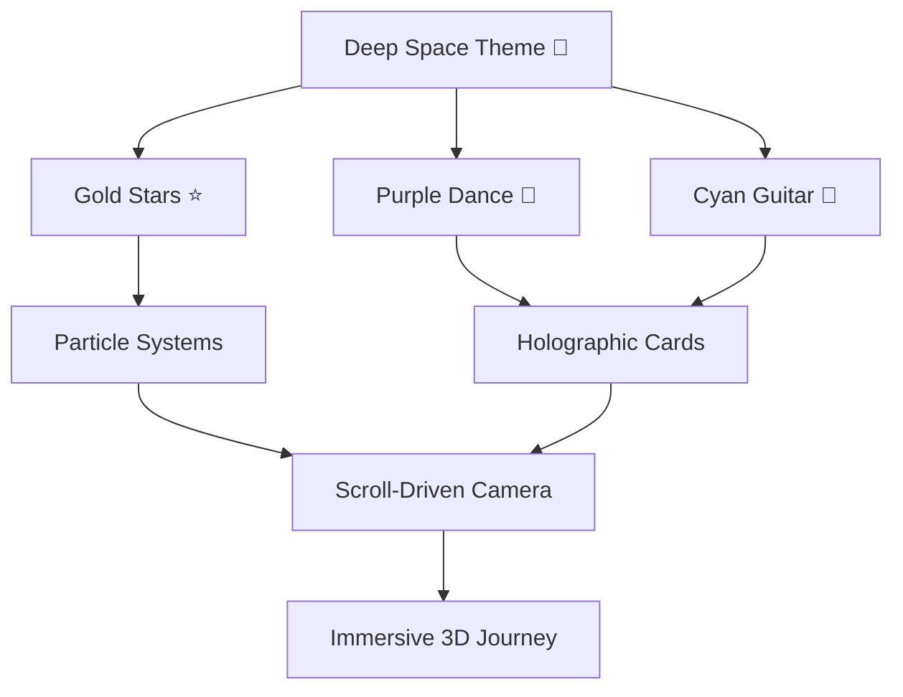

# 🌟 Little Star Dance & Guitar Academy — 3D Animated Website

A cinematic, scroll-driven 3D website for **Little Star Dance & Guitar Academy** that will blow visitors away with immersive WebGL visuals, particle animations, and smooth scroll-triggered transitions.

## Tech Stack

| Layer | Technology | Purpose |
|-------|-----------|---------|
| **Framework** | Vite + Vanilla JS | Fast dev server, zero bloat |
| **3D Engine** | Three.js | WebGL rendering, 3D scenes |
| **Animation** | GSAP + ScrollTrigger | Scroll-synced cinematic animations |
| **Smooth Scroll** | Lenis | Buttery smooth scroll experience |
| **Styling** | Vanilla CSS | Custom design system, glassmorphism |
| **Fonts** | Google Fonts (Outfit + Dancing Script) | Premium typography |
| **Icons** | Lucide Icons (CDN) | Lightweight SVG icons |

> [!IMPORTANT]
> **No React/R3F** — We're going pure vanilla Three.js + GSAP for maximum control, smaller bundle, and faster load times. This keeps it simple to deploy and maintain.

---

## 🎯 Website Sections (Scroll-Driven 3D Journey)

The entire website is a **single-page scroll experience** where the 3D scene transforms as the user scrolls through sections:

### Section 1: Hero — "Enter the Stage" 🎭
- **3D Scene**: A spotlight stage with animated 3D star particles swirling in a vortex
- **Camera**: Starts far out, zooms into the stage on scroll
- **Content**: Academy name in large 3D-extruded text, tagline, CTA button
- **Effects**: Particle trails, lens flare, volumetric fog
- **Phone number** floating with glassmorphism card

### Section 2: About — "Our Story" 📖
- **3D Scene**: Camera orbits around a 3D music note + dance figure silhouette
- **Content**: Academy description, mission statement
- **Effects**: Floating musical notes, gentle rotation
- **Transition**: Stars morph into musical notes

### Section 3: Services — "What We Teach" 🎸💃
- **3D Scene**: Two floating 3D cards (Dance & Guitar) that rotate and flip on scroll
- **Content**: Dance Classes details, Guitar Classes details
- **Effects**: Cards have holographic/iridescent shader material
- **Interaction**: Hover causes cards to tilt in 3D (parallax)

### Section 4: Gallery — "Our Stars Shine" ✨
- **3D Scene**: Photos arranged in a 3D carousel/helix that rotates on scroll
- **Content**: Performance photos/videos in 3D frames
- **Effects**: Images float in 3D space, spotlight follows active image
- **Interaction**: Click to expand photo in lightbox

### Section 5: Performance Videos — "Watch Us Move" 🎬
- **3D Scene**: A 3D cinema screen that unfolds from the scene
- **Content**: Embedded YouTube/video players
- **Effects**: Screen materializes with glitch effect, ambient particles

### Section 6: Batch Timings — "Find Your Rhythm" ⏰
- **3D Scene**: A 3D rotating clock/calendar visualization
- **Content**: Weekly schedule table with batch timings for Dance & Guitar
- **Effects**: Time slots glow and pulse, 3D timetable cards
- **Layout**: Beautiful justified grid of timing cards

### Section 7: Events — "Spotlight Moments" 🎪
- **3D Scene**: A 3D timeline ribbon flowing through space
- **Content**: Upcoming events, past event highlights
- **Effects**: Timeline nodes light up as you scroll past them

### Section 8: Registration — "Join the Stars" 📝
- **3D Scene**: A glowing portal/doorway effect
- **Content**: Online registration form (Name, Phone, Class, Batch)
- **Effects**: Form fields have 3D depth, submit button has particle burst
- **Action**: Form data sent to email or stored (configurable)

### Section 9: Footer — "Stay Connected" 🌐
- **3D Scene**: Stars settle into a constellation forming the academy logo
- **Content**: Contact info, social links, Google Maps embed
- **Effects**: Twinkling star field background

---

## 🏗️ Proposed File Structure

```
e:\builder\mine\
├── index.html              # Main HTML file
├── package.json            # Dependencies
├── vite.config.js          # Vite configuration
├── public/
│   ├── fonts/              # Self-hosted fonts (fallback)
│   └── images/             # Gallery images, textures
│       ├── gallery/        # Performance/event photos
│       ├── textures/       # 3D material textures
│       └── logo.png        # Academy logo
├── src/
│   ├── main.js             # Entry point — initializes everything
│   ├── style.css           # Global design system + all styles
│   ├── three/
│   │   ├── scene.js        # Three.js scene setup (camera, renderer, lights)
│   │   ├── particles.js    # Star/music note particle systems
│   │   ├── objects.js      # 3D objects (cards, stage, clock, portal)
│   │   ├── shaders.js      # Custom GLSL shaders (holographic, glow)
│   │   └── postprocessing.js  # Bloom, chromatic aberration effects
│   ├── animations/
│   │   ├── scroll.js       # GSAP ScrollTrigger + Lenis setup
│   │   ├── transitions.js  # Section transition animations
│   │   └── interactions.js # Hover/click micro-interactions
│   ├── sections/
│   │   ├── hero.js         # Hero section DOM + 3D
│   │   ├── about.js        # About section
│   │   ├── services.js     # Services section (Dance + Guitar cards)
│   │   ├── gallery.js      # Gallery carousel
│   │   ├── videos.js       # Performance videos
│   │   ├── schedule.js     # Batch timings
│   │   ├── events.js       # Event showcase
│   │   ├── registration.js # Online registration form
│   │   └── footer.js       # Footer + constellation
│   └── utils/
│       ├── loader.js       # Asset loader with progress bar
│       └── responsive.js   # Responsive 3D scaling
```

---

## Proposed Changes

### Core Setup

#### [NEW] [package.json](file:///e:/builder/mine/package.json)
- Vite as dev server/bundler
- `three` (Three.js) for 3D rendering
- `gsap` with ScrollTrigger plugin for scroll-driven animations
- `lenis` for smooth scrolling
- `postprocessing` for bloom/glow effects

#### [NEW] [vite.config.js](file:///e:/builder/mine/vite.config.js)
- Standard Vite config with proper asset handling

#### [NEW] [index.html](file:///e:/builder/mine/index.html)
- Single-page structure with 9 scrollable sections
- Fixed `<canvas>` element for Three.js (background layer)
- Semantic HTML5 sections overlaid on top of 3D canvas
- Google Fonts (Outfit + Dancing Script)
- SEO meta tags, Open Graph tags
- Preloader screen with animated logo

---

### 3D Engine Layer

#### [NEW] [src/three/scene.js](file:///e:/builder/mine/src/three/scene.js)
- Three.js Scene, PerspectiveCamera, WebGLRenderer setup
- Responsive canvas sizing
- Ambient + spot + point lights with color temperatures
- Fog for depth effect
- Animation loop (`requestAnimationFrame`)

#### [NEW] [src/three/particles.js](file:///e:/builder/mine/src/three/particles.js)
- **Star Particle System**: 2000+ particles forming a swirling galaxy
- **Music Note Particles**: Floating ♪ ♫ shapes
- **Transition Effects**: Particles morph between formations on scroll
- GPU-optimized with `BufferGeometry` + `PointsMaterial`

#### [NEW] [src/three/objects.js](file:///e:/builder/mine/src/three/objects.js)
- **3D Service Cards**: Holographic floating cards for Dance/Guitar
- **3D Stage**: Spotlight platform for hero
- **3D Clock**: Animated clock for schedule section
- **3D Portal**: Glowing ring for registration section
- **3D Frames**: Picture frames for gallery
- All created procedurally (no external model files needed)

#### [NEW] [src/three/shaders.js](file:///e:/builder/mine/src/three/shaders.js)
- **Holographic Shader**: Iridescent rainbow effect for cards
- **Glow Shader**: Pulsing neon glow for highlights
- **Gradient Shader**: Dynamic background color transitions
- Custom GLSL vertex + fragment shaders

#### [NEW] [src/three/postprocessing.js](file:///e:/builder/mine/src/three/postprocessing.js)
- Bloom effect (UnrealBloom) for glowing elements
- Chromatic aberration for cinematic feel
- Vignette for depth focus
- Effect composer pipeline

---

### Animation Layer

#### [NEW] [src/animations/scroll.js](file:///e:/builder/mine/src/animations/scroll.js)
- Lenis smooth scroll initialization
- GSAP ScrollTrigger registration
- Scroll progress tracking (0→1 per section)
- Camera path interpolation based on scroll
- Section-specific animation triggers
- Parallax depth for HTML content

#### [NEW] [src/animations/transitions.js](file:///e:/builder/mine/src/animations/transitions.js)
- Section enter/exit animations
- 3D object appearance/disappearance
- Color theme transitions per section
- Text reveal animations (split text, stagger)

#### [NEW] [src/animations/interactions.js](file:///e:/builder/mine/src/animations/interactions.js)
- Mouse parallax on 3D objects
- Hover tilt effect on cards (VanillaTilt-style)
- Magnetic cursor effect near buttons
- Click ripple effects
- Touch support for mobile

---

### Section Content Layer

#### [NEW] [src/sections/hero.js](file:///e:/builder/mine/src/sections/hero.js)
- Academy name with gradient text
- "Where Stars Are Born" tagline
- Animated CTA: "Explore Classes" & "Register Now"
- Phone number glassmorphism badge
- 3D star burst animation on load

#### [NEW] [src/sections/about.js](file:///e:/builder/mine/src/sections/about.js)
- Academy story and mission
- Key stats (students trained, years active, etc.)
- Animated counter numbers

#### [NEW] [src/sections/services.js](file:///e:/builder/mine/src/sections/services.js)
- Dance Classes card: styles taught, age groups, benefits
- Guitar Classes card: acoustic, electric, beginner→advanced
- 3D holographic card flip on scroll

#### [NEW] [src/sections/gallery.js](file:///e:/builder/mine/src/sections/gallery.js)
- 3D photo carousel/helix
- Lightbox viewer on click
- Category filters (Dance / Guitar / Events)
- Generated placeholder images initially

#### [NEW] [src/sections/videos.js](file:///e:/builder/mine/src/sections/videos.js)
- 3D cinema screen embed
- Video thumbnails grid
- Play button with particle burst
- YouTube embed support

#### [NEW] [src/sections/schedule.js](file:///e:/builder/mine/src/sections/schedule.js)
- Weekly timetable with justified grid layout
- Dance batches: Morning, Evening, Weekend
- Guitar batches: Beginner, Intermediate, Advanced
- 3D cards that flip to reveal details
- Color-coded by class type

#### [NEW] [src/sections/events.js](file:///e:/builder/mine/src/sections/events.js)
- 3D timeline visualization
- Upcoming events with countdown
- Past event highlights with photos
- "Annual Showcase" feature

#### [NEW] [src/sections/registration.js](file:///e:/builder/mine/src/sections/registration.js)
- Full registration form (Student Name, Parent Name, Phone, Email, Class Selection, Batch Preference)
- Form validation with animated feedback
- Submit with 3D portal animation
- Success state with confetti particles

#### [NEW] [src/sections/footer.js](file:///e:/builder/mine/src/sections/footer.js)
- Contact information with 3D icons
- Social media links
- Google Maps integration
- Star constellation background
- "Made with ❤️" credit

---

### Design System

#### [NEW] [src/style.css](file:///e:/builder/mine/src/style.css)

**Color Palette:**
| Token | Value | Usage |
|-------|-------|-------|
| `--bg-primary` | `#0a0a1a` | Deep space black |
| `--bg-secondary` | `#12122a` | Section backgrounds |
| `--accent-gold` | `#ffd700` | Star/highlight color |
| `--accent-purple` | `#8b5cf6` | Dance theme |
| `--accent-cyan` | `#06b6d4` | Guitar theme |
| `--accent-pink` | `#ec4899` | CTAs and active states |
| `--text-primary` | `#f1f5f9` | Main text |
| `--text-secondary` | `#94a3b8` | Subdued text |
| `--glass-bg` | `rgba(255,255,255,0.05)` | Glassmorphism |
| `--glass-border` | `rgba(255,255,255,0.1)` | Glass borders |

**Design Features:**
- Glassmorphism cards with backdrop-blur
- CSS Grid + Flexbox layouts
- Responsive breakpoints (mobile-first)
- Custom scrollbar styling (hidden, smooth)
- Text gradient effects
- Animated underlines
- Proper justified spacing for schedule

---

### Utilities

#### [NEW] [src/utils/loader.js](file:///e:/builder/mine/src/utils/loader.js)
- Animated preloader with academy logo
- Asset loading progress bar
- Smooth transition to content on load complete

#### [NEW] [src/utils/responsive.js](file:///e:/builder/mine/src/utils/responsive.js)
- Dynamic pixel ratio adjustment for mobile
- Camera FOV scaling for different screen sizes
- Touch gesture support
- Reduced motion preference detection

#### [NEW] [src/main.js](file:///e:/builder/mine/src/main.js)
- Orchestrator: initializes scene, animations, sections
- Event listeners setup
- Performance monitoring

---

## 🎨 Visual Design Philosophy



- **Dark theme** with deep space backgrounds — stars feel like home
- **Gold accents** for the "Star" branding — premium feel
- **Purple for Dance**, **Cyan for Guitar** — visual separation of services
- **Glassmorphism** for all UI cards — modern, floating feel
- **Particle effects** throughout — magical, lively atmosphere

---

## User Review Required

> [!IMPORTANT]
> **Gallery Images**: I'll generate placeholder images for the gallery using AI. You should replace these with actual academy photos later. Should I generate dance/guitar themed images for now?

> [!IMPORTANT]
> **Registration Form Backend**: The form will collect data but needs a backend to store it. Options:
> 1. **Email via Formspree** (free, easiest) — submissions go to your email
> 2. **Google Sheets** via Apps Script — free, easy to manage
> 3. **Firebase** — free tier, real database
> 
> Which do you prefer?

> [!IMPORTANT]
> **Video Content**: Should I embed placeholder YouTube videos, or do you have specific video URLs for the academy?

---

## Open Questions

> [!NOTE]
> 1. **Logo**: Do you have a logo for Little Star Academy? If not, I'll create a text-based logo with star motif
> 2. **Batch Timings**: Can you provide the actual class schedule? (Days, times, age groups)
> 3. **Events**: Any upcoming events to showcase?
> 4. **Social Media**: Any Instagram/Facebook/YouTube links to include?
> 5. **Photos**: Any real photos of the academy, students, or performances?

---

## Verification Plan

### Automated Tests
- Run `npm run dev` and verify all sections render
- Test scroll animations are smooth (60fps target)
- Test responsive design at 320px, 768px, 1024px, 1440px widths
- Verify registration form validation
- Check lighthouse score (Performance, SEO, Accessibility)

### Browser Testing
- Open the site in the browser tool and scroll through all sections
- Verify 3D scene renders correctly
- Test hover interactions on service cards
- Test gallery lightbox
- Test registration form submission
- Take screenshots of each section for review

### Performance Targets
| Metric | Target |
|--------|--------|
| FPS | 60fps on desktop, 30fps on mobile |
| LCP | < 2.5s |
| Bundle Size | < 500KB gzipped |
| Lighthouse Performance | > 80 |

---

## Deployment

The site can be deployed to:
- **Vercel** (recommended, free, automatic HTTPS)
- **Netlify** (free alternative)
- **GitHub Pages** (free, needs build step)

Just run `npm run build` and deploy the `dist/` folder.
